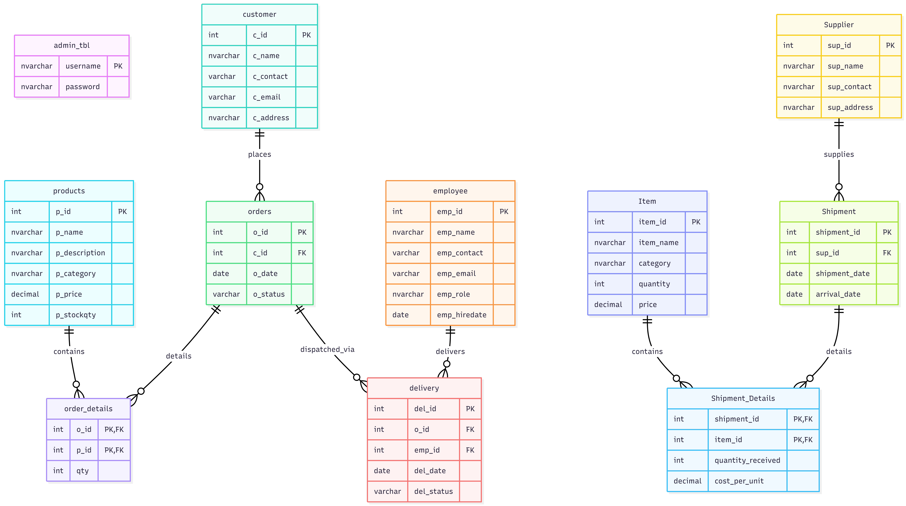

# Crochet Craft Store Management System (CCMS)
An enterprise-grade **C# WPF** desktop application integrated with **SQL Server (T-SQL)**, designed as a comprehensive retail ecosystem for a handmade crochet store. Built to satisfy rigorous academic standards for 3rd-semester database design, featuring 3NF normalization, transactional integrity, and stored procedures.

---

## 🌟 Key Features

### 🔐 1. Admin Authentication & Security
* **Secure Login**: Local user authentication via database-backed password lookup.
* **Stored Procedure Auth**: Leverages `dbo.admin_login_check` to encapsulate credential checks safely.
* **Password Management**: In-app password updates matching strict length requirements via `dbo.admin_change_password`.

### 👥 2. Customer Relationship Management (CRM)
* **Full CRUD Operations**: Register, update contact details (email, address, contact), and search customers by ID or name.
* **Intelligent Customer Insights**: Displays top customers ranked by total spending, helping identify high-value clients.
* **Purchase History Queries**: Drill down into detailed purchasing logs for individual clients.

### 👔 3. Employee & Rider Operations
* **Staff Records**: Maintain complete records of name, contact details, email, role, and hire date.
* **Rider Assignment**: Tracks delivery assignments for riders and provides real-time logs of their pending and completed jobs.

### 🧶 4. Inventory & Product Management
* **Interactive Listings**: Track crochet category (e.g., Bouquets, Baby Caps, Bags, Toys), unit prices, and current stock.
* **Low Stock Alerts**: Automatic UI highlighting for products running low on stock (< 10 units) to trigger re-orders.
* **Trigger-Driven Restocking**: Adding supplier shipments automatically updates stock levels and updates standard prices in the inventory.

### 🛒 5. Advanced Order & Checkout System
* **Dynamic Shopping Cart**: Multi-product interactive cart allowing product additions, quantity limits, and real-time total bill calculation.
* **Transactional Multi-Row Order Posting**: Utilizes a **Table-Valued Parameter (TVP)** (`orderproducts`) to insert complex, multi-item orders in a single atomic database request.
* **Transaction Rollback Protection**: Utilizes T-SQL transactions (`BEGIN TRANSACTION / COMMIT / ROLLBACK`) inside stored procedures to ensure that if any item stock is insufficient, the entire order is safely rolled back to prevent dirty data states.

### 🚚 6. Logistical Delivery Pipeline
* **Logistics Dispatch**: Track dispatch date, status (pending/completed), and assign designated riders.
* **Auto-Resolution Trigger**: Completing a delivery automatically marks the underlying customer order as successfully completed in the database.

---

## 📐 Database Architecture & Entity Relationships

The relational database is strictly normalized to **Third Normal Form (3NF)** to eliminate redundancy and maintain domain constraints.



### Key Relational Features:
1. **Primary & Foreign Key Constraints**: Strict referential integrity prevents orphaned orders or assignments.
2. **Table-Valued Parameter Type (`dbo.orderproducts`)**: Allows structured collections of items to be processed as parameters by procedures.
3. **Database Triggers**:
   * **Shipment Stock Incrementor**: Automatically adds incoming supplier shipments to inventory.
   * **Real-time Standard Price Adjuster**: Automatically adjusts retail item standard pricing on new shipments based on cost price.

---

## 🛠️ Technical Stack
* **Front-End User Interface**: WPF (Windows Presentation Foundation), XAML, C# (Async-Await pattern for fluid UI thread performance).
* **Database Management System**: SQL Server Express (`.\SQLEXPRESS`), LocalDB.
* **Data Access Layer**: ADO.NET (SqlDataAdapter, SqlConnection, SqlCommand, SqlParameter, Transactions, User-Defined Table Types).

---

## 🚀 Setting Up the Application

### Prerequisites:
* Microsoft SQL Server Express (configured as `.\SQLEXPRESS` or another named instance).
* Microsoft Visual Studio 2019 / 2022 (with **.NET desktop development** workload installed).

---

### Step 1: Database Setup & Seeding
1. Open **SQL Server Management Studio (SSMS)** or visual tools inside Visual Studio.
2. Connect to your local SQL Server instance (`.\SQLEXPRESS`).
3. Create a database named `db_crochet_craft3` (or execute the script to automatically target it).
4. Run the comprehensive restoration script:
   ```bash
   sqlcmd -S .\SQLEXPRESS -E -i "db_crochet_craft_complete.sql"
   ```
   *This script instantiates all 11 tables, creates the `orderproducts` TVP type, registers 27 stored procedures/triggers, and seeds it with realistic, high-quality test data.*

---

### Step 2: Open and Run the C# WPF Application
1. In Visual Studio, select **Open a project or solution** and choose the solution file:
   `crochet_store.slnx` (or the project file `crochet_store/crochet_store.csproj`).
2. Verify that the connection string inside `DBConnection.cs` is configured correctly for your SQL Server. Example:
   ```csharp
   public static readonly string ConnectionString =
       @"Data Source=.\SQLEXPRESS;
         Initial Catalog=db_crochet_craft3;
         Integrated Security=True;
         Encrypt=False;";
   ```
3. Press **F5** or click **Start** in the toolbar to compile and run the application.

---

## 🔑 Login Credentials

Use the following seed credentials to explore the admin dashboard and operations:

* **Username**: `admin`
* **Password**: `admin123`

---

## 🎓 Academic Highlights (For Project Grading)
This project has been engineered to perfectly satisfy the requirements of advanced undergraduate database courses:
* **Strict 3NF Compliance**: No partial dependency or transitive dependency anomalies are present. Customer profiles, order logs, product details, supplier records, and deliveries are segregated cleanly.
* **Bulk Insertion using TVPs**: Instead of running multiple separate loops and connections to insert individual order items, a C# `DataTable` is populated and sent as an atomic `Structured` parameter (`orderproducts` Table-Valued Parameter) directly to `dbo.add_order`.
* **Atomic Transactions**: All multi-step actions (like checking stock availability, adding orders, writing order details, and creating logistics records) are placed inside a database transaction block. If any step fails (e.g. stock runs out), the transaction safely **rolls back** everything, guaranteeing consistent inventory levels.
* **Defensive DB Constraints**: Implements check constraints (pricing $> 0$, phone numbers of specific lengths, valid shipment dates where `arrival_date >= shipment_date`).
* **Trigger Automation**: Eliminates front-end synchronization issues by having the database trigger automatic inventory changes upon supplier shipment reception.

---

## 📄 License
This project is licensed under the [MIT License](LICENSE). Feel free to use, modify, and distribute it for academic or personal projects.

